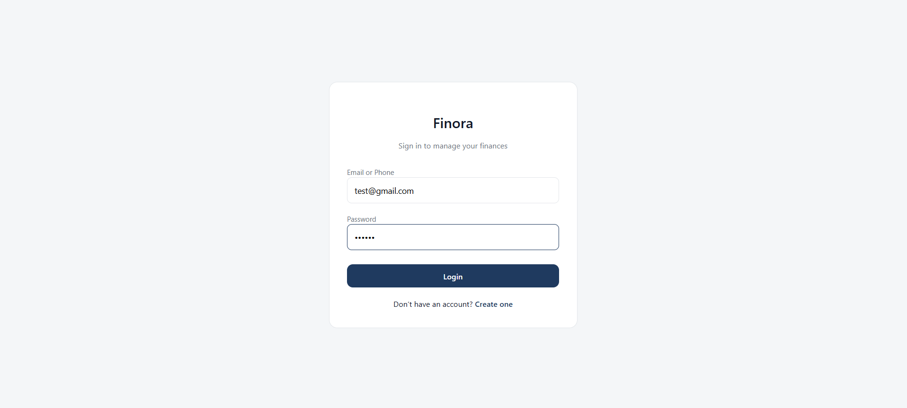
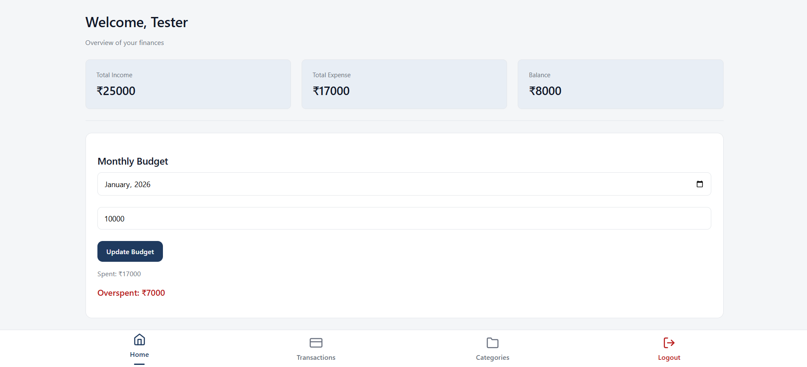
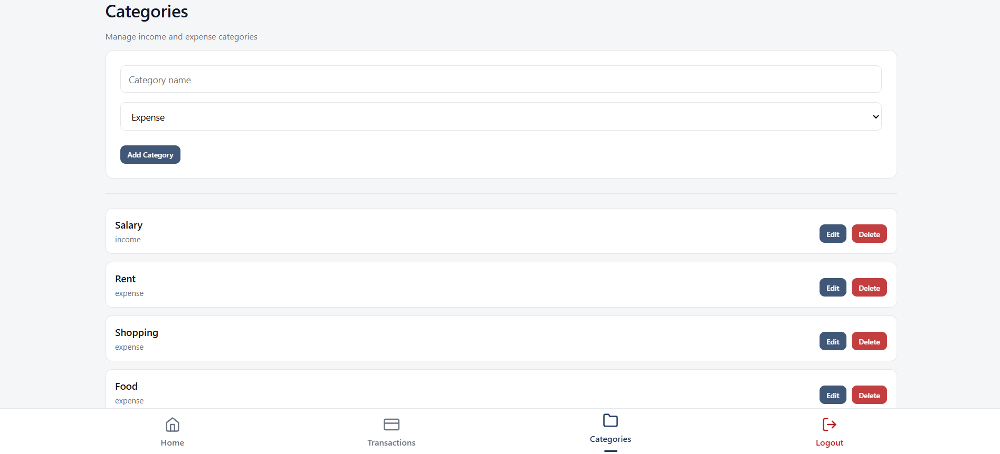
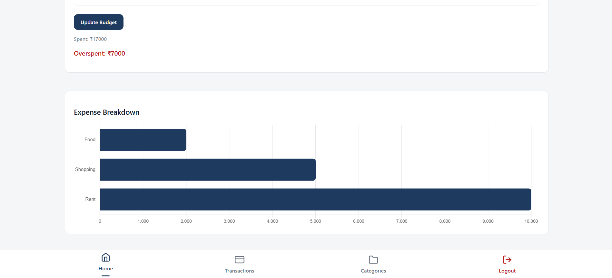

# Finance Tracker with Budgeting

**Finance Tracker with Budgeting** is a full-stack MERN web application built to help users manage their personal finances efficiently. The application allows users to record income and expenses, categorize transactions, set monthly budgets, and visualize spending patterns through interactive charts.

---

## 🛠 Tech Stack

- **Frontend:** React.js  
- **Backend:** Node.js, Express.js  
- **Database:** MongoDB  
- **Charts & Visualization:** Chart.js  
- **Styling:** Custom CSS (Responsive & Professional UI)  
- **Architecture:** MERN Stack (Client–Server separation)

---

## ✨ Key Features

- User-specific transaction and category management  
- Add, edit, and delete income and expense transactions  
- Category-wise expense tracking  
- Monthly budgeting with **overspent / remaining** indicators  
- Interactive bar charts for expense analysis  
- Responsive design (mobile & desktop)  
- Clean, intuitive, real-world UI

---

## 📂 Application Modules

### 🔐 Authentication
Users can securely log in and access only their personal financial data.

### 📊 Dashboard
Displays:
- Total income
- Total expenses
- Balance
- Monthly budget status
- Expense breakdown charts

### 💰 Transactions
- Add, edit, delete transactions  
- Filter income and expenses  
- Optional notes for each transaction

### 📁 Categories
- Create, edit, and delete income/expense categories  
- Fully user-specific category management

---

## 📸 Screenshots

### Login

### Dashboard

### Transactions

### Categories

### Expense Chart

